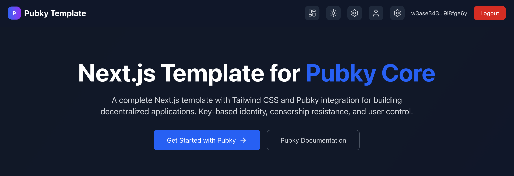
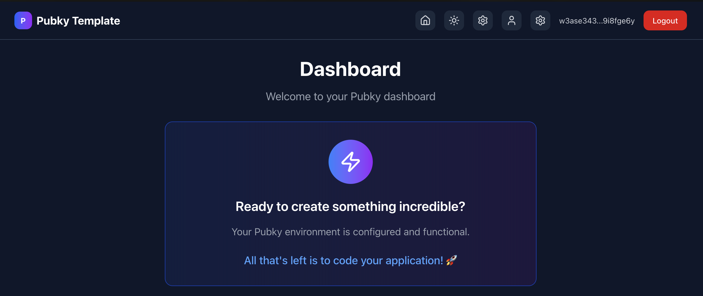
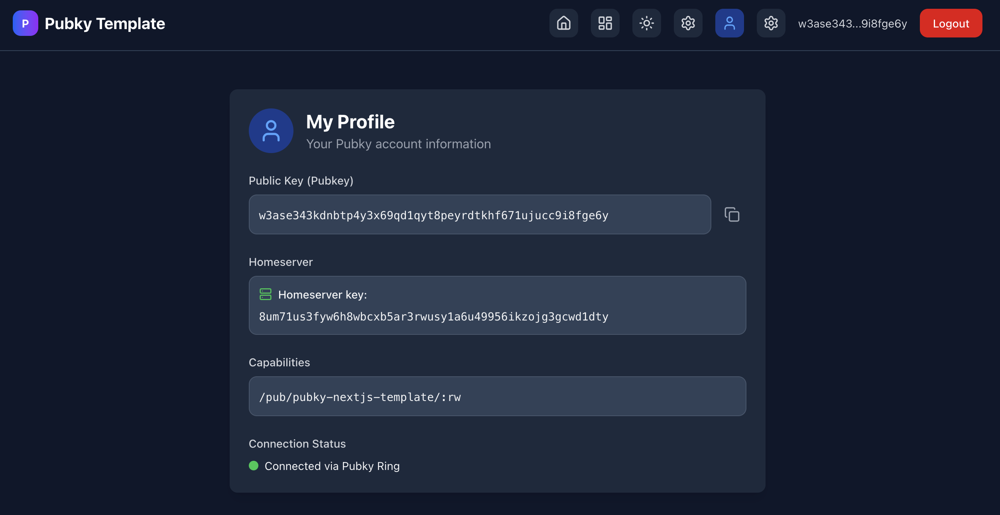
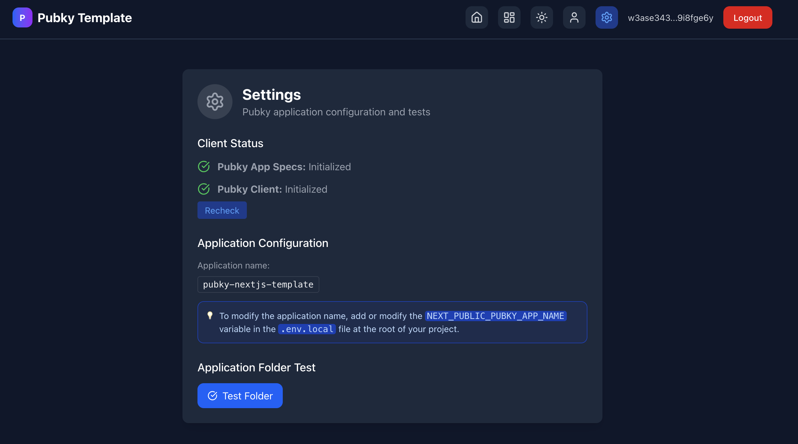

# Pubky Next.js Template

A complete Next.js template with Tailwind CSS and Pubky integration for building decentralized applications. Key-based identity, censorship resistance, and user control.

## Screenshots

### Homepage


### Dashboard


### Profile


### Settings


This is a [Next.js](https://nextjs.org) project bootstrapped with [`create-next-app`](https://nextjs.org/docs/app/api-reference/cli/create-next-app).

## Features

- 🔐 **Pubky Authentication**: Secure key-based identity system
- 🌐 **Decentralized**: Built on Pubky Core for censorship resistance
- 🎨 **Modern UI**: Beautiful interface with Tailwind CSS
- 📱 **Responsive**: Works on all devices
- 🔧 **TypeScript**: Full type safety
- ⚡ **Fast**: Optimized Next.js performance
- 🛡️ **Secure**: User-controlled data and privacy

## Pubky Integration

This template uses the following Pubky packages:

### Core Dependencies
- **[@synonymdev/pubky](https://www.npmjs.com/package/@synonymdev/pubky)** `^0.5.4` - Core Pubky SDK for decentralized identity and data management
- **[pubky-app-specs](https://www.npmjs.com/package/pubky-app-specs)** `^0.3.5` - Application specifications and schemas for Pubky apps

### Authentication Flow
1. **Pubky Ring App** - Mobile app for secure key management and authentication
2. **QR Code Authentication** - Scan QR codes to connect your Pubky identity
3. **Decentralized Storage** - Your data is stored on your chosen homeserver
4. **Key-based Identity** - No passwords, just cryptographic keys

### How it Works
- Users authenticate using the **Pubky Ring** mobile app
- The app generates QR codes for secure connection
- All user data is stored on decentralized homeservers
- Users maintain full control over their identity and data

## Installation

1. **Clone the repository**
```bash
git clone https://github.com/PastaGringo/pubky-nextjs-template.git
cd pubky-nextjs-template
```

2. **Install dependencies**
```bash
npm install
# or
yarn install
# or
pnpm install
```

3. **Set up environment variables**
```bash
cp .env.example .env.local
```

Edit `.env.local` and update the values according to your needs:
- `NEXT_PUBLIC_PUBKY_APP_ID`: Your unique application ID
- `NEXT_PUBLIC_PUBKY_APP_NAME`: Your application name
- `PUBLIC_DOMAIN`: Your domain (localhost:3000 for development)

## Getting Started

Run the development server:

```bash
npm run dev
# or
yarn dev
# or
pnpm dev
# or
bun dev
```

Open [http://localhost:3000](http://localhost:3000) with your browser to see the result.

You can start editing the page by modifying `app/page.tsx`. The page auto-updates as you edit the file.

This project uses [`next/font`](https://nextjs.org/docs/app/building-your-application/optimizing/fonts) to automatically optimize and load [Geist](https://vercel.com/font), a new font family for Vercel.

## Learn More

To learn more about Next.js, take a look at the following resources:

- [Next.js Documentation](https://nextjs.org/docs) - learn about Next.js features and API.
- [Learn Next.js](https://nextjs.org/learn) - an interactive Next.js tutorial.

You can check out [the Next.js GitHub repository](https://github.com/vercel/next.js) - your feedback and contributions are welcome!

## Deploy on Vercel

The easiest way to deploy your Next.js app is to use the [Vercel Platform](https://vercel.com/new?utm_medium=default-template&filter=next.js&utm_source=create-next-app&utm_campaign=create-next-app-readme) from the creators of Next.js.

Check out our [Next.js deployment documentation](https://nextjs.org/docs/app/building-your-application/deploying) for more details.
